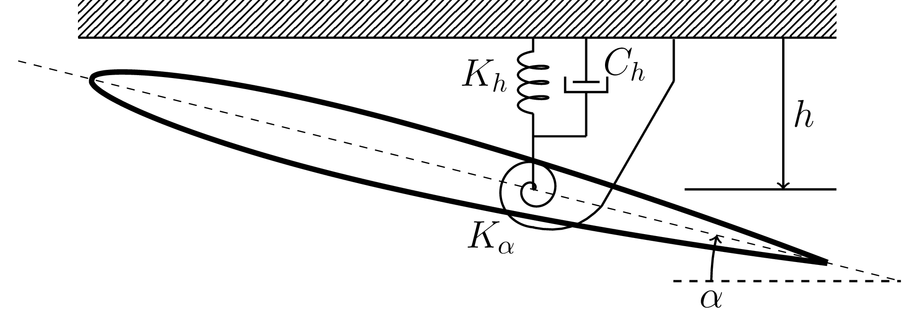

Data Driven à la mode mais en fait pas tout jeune
=================================================

Pourquoi ce dépôt ?
-------------------

Ce dépôt contient quelques exemples de résolution de problèmes jouets par des approches dites data-driven. L'objectif ici est simplement de montrer que les approches data driven, à la mode ces derniers temps, peuvent en fait simplement se mettre en place à partir de méthodes établies depuis longtemps. 

Installation
------------

Ce projet nécessite un compilateur c++ compatible c++11 et la librairie Eigen. La compilation se réalise via la chaine de compilation SCons::

  scons EIGEN_INC=/my/eigen/header/files/directory

Licence
-------

Ce dépôt utilise la librairie Eigen et également la librairie TinyXml (les sources de TinyXml sont directement incluses dans le projet)

Applications
------------

1 - Aéroélasticité
^^^^^^^^^^^^^^^^^^ 

Le premier exemple traité est un problème d'aéroélasticité à deux degrés de libertés. 

  
